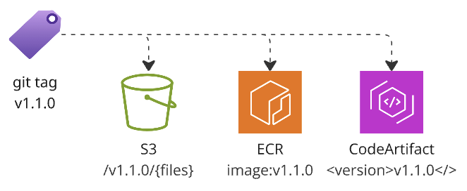

# About
Your Swiss knife to do publish/release software in AWS with GitHub action.
This action: 1) publish software artifacts; 2) git commit and push tags; 3) generate GH release.

_Called it 'publish' bcz it takes most effort, whereas GitHub 'release' is optional and relatively simple.
Terms 'publish' and 'release' are used interchangeably_



Main use case — microservices that hold application code and infrastructure code (like Terraform).
The action generates new version based on latest git version tag and SemVer commits tags `fix:`, `feat:` and `BREAKING CHANGE:`, see [conventionalcommits](https://www.conventionalcommits.org/en/v1.0.0/).
Then action publishes artifacts and pushes git tags so your artifacts and git tags are in sync. Also creates a GitHub release based off the that ta

This table shows supported artifact types and features:

| Name                   | floating-tags | idempotency | version update | dev-release |
|------------------------|---------------|-------------|----------------|-------------|
| git                    | ✅             | ✅           | N/A            | ✅           |
| AWS S3                 | ✅             | ✅           | N/A            | ✅           |
| AWS ECR                | ✅             | ✅           | N/A            | ✅           |
| AWS CodeArtifact maven | N/A           | ⚠️          | ✅              | ⚠️          |
| npmjs public repo      | N/A           | ⚠️          | ✅              | ❌           |

1. Validate
2. Release generation
   1. generate a new version based on the latest tag + git commit messages
   2. generate release notes (keep as step output)
3. Login in AWS
4. Prepare: mainly bump versions in language/tool specific files
   1. update version in `pom.xml` (for maven)
   2. update version in `package.json` (for npm)
   3. run a custom script (can use to update a cache key!)
   4. (TBD) update CHANGELOG.md
   5. git commit
5. Publish artifacts
   1. AWS S3 - upload files in S3 bucket, files need to be in `./s3` directory
   2. AWS ECR - publish Docker image in ECR repository
   3. AWS CodeArtifact maven - publish maven package in CodeArtifact repository
   4. npmjs - publish npm package in npmjs.com repository
6. Git push
   1. commit changes from step 3
   2. besides SemVer 'major.minor.patch', also add floating tags 'major', 'major.minor' and 'latest'
   3. atomically push commit and tags to the remote repository
7. GitHub release
   1. create a GitHub release tied to the most recent tag

**Semantic Release usage**:
NPM library [semantic-release](https://github.com/semantic-release) is used to generate next version and release notes.
It is used in `dryRun` mode, so it doesn't commit changes, push tags, or create a GitHub release.
Semantic-release has rich family of plugins and shared configuration. `agilecustoms/publish` action uses only two main plugins:
[commit-analyzer](https://github.com/semantic-release/commit-analyzer) and [release-notes-generator](https://github.com/semantic-release/release-notes-generator)
so they take configuration as per `semantic-release` documentation in extent that `dryRun` mode supports.
Plugin [changelog](https://github.com/semantic-release/changelog) is not used, instead `agilecustoms/publish` implements its own logic to update `CHANGELOG.md` file,
but you can use same options as for `changelog` plugin: `changelog-file` and `changelog-title`.
Other plugins are not supported. Feel free to raise an issue / pull request or discussion if you need some specific plugin to be supported

**Limitations**:
- only `on: push` event is supported — it covers both direct push and PR merge. `on: pull_request` is not yet supported
- not designed/tested for monorepos where tags have package/prefixes like `package/v1.2.3`

**Consistency**. This GH action does two modify operations: "Publish artifacts" and then "Git push"
Some of them need to go first, and then you need to be prepared what to do if second fails.
Rationale to have "Git push" the last: 1) it is least likely to fail; 2) provided that all publish steps are idempotent,
you can fix "Git push" issue and re-run the workflow w/o side effects.
Some publish commands are not idempotent (like npm publish), so as workaround - just ignore 'same version already exists' type of errors 
if it is already not first workflow run (use `${{ github.run_attempt }}`)

## Inputs

| Name                        | Description                                                                                                                                          | Default         |
|-----------------------------|------------------------------------------------------------------------------------------------------------------------------------------------------|-----------------|
| aws-account                 | AWS account to publish artifacts to. Not needed if there are no artifacts, just git tag                                                              |                 |
| aws-region                  | AWS region                                                                                                                                           |                 |
| aws-role                    | IAM role to assume to publish, ex. `/ci/publisher`                                                                                                   |                 |
| aws-codeartifact-domain     | CodeArtifact domain name, ex. `mycompany`                                                                                                            |                 |
| aws-codeartifact-repository | CodeArtifact repository name, ex. `maven`                                                                                                            |                 |
| aws-codeartifact-maven      | If true, then publish maven artifacts to AWS CodeArtifact                                                                                            |                 |
| aws-ecr                     | If true, then push docker image to ECR                                                                                                               |                 |
| aws-s3-bucket               | S3 bucket to upload artifacts to                                                                                                                     |                 |
| aws-s3-dir                  | Allows to specify S3 bucket directory to upload artifacts to. By default just place in `bucket/{repo-name}/{version}/*`                              |                 |
| changelog-file              | CHANGELOG.md file path. Pass empty string to disable changelog generation                                                                            | CHANGELOG.md    |
| changelog-title             | Title of the changelog file (first line of the file)                                                                                                 | # Changelog\n\n |
| dev-release                 | Allows to create temporary named release, mainly for dev testing. Implementation is different for all supported artifact types                       | false           |
| dev-branch-prefix           | Allows to enforce branch prefix for dev-releases, this help to write auto-disposal rules. Empty string disables enforcement                          | dev/            |
| floating-tags               | When next version to be released is 1.2.4, then also release 1, 1.2 and latest. Not desired for public terraform modules                             | true            |
| node-version                | Node.js version to publish npm packages, default is 22 (pre-cached in Ubuntu 24)                                                                     | 22              |
| release-gh                  | If true, then create a GitHub release with the same name as the tag                                                                                  | true            |
| tag-format                  | By-default tag (version) has format `v1.0.0`. Use `${version}` to remove `v` prefix                                                                  | v${version}     |
| version                     | Explicit version to use instead of auto-generating. When provided, only this single version/tag will be created (no `latest`, `major`, `minor` tags) |                 |
| version-update-script       | sh script that allows to update version in custom file(s), not only files governed by build tool (pom.xml, package.json, etc)                        |                 |

## Environment variables

| Name            | Description                                                                                                              |
|-----------------|--------------------------------------------------------------------------------------------------------------------------|
| NODE_AUTH_TOKEN | If specified - will publish an npm package in public npmjs repo                                                          |
| GH_TOKEN        | Required if `release-gh: true` (default). Can be default token `${{ github.token }}` or PAT `${{ secrets.MY_GH_TOKEN }}` |

## Outputs

| Name              | Description                                                                                                                                                                                                                                                                                                            |
|-------------------|------------------------------------------------------------------------------------------------------------------------------------------------------------------------------------------------------------------------------------------------------------------------------------------------------------------------|
| changes_detected  | true if some changes were commited. Many artifacts release assumes changes such as pom.xml and package.json. Also you might have custom script that made some changes. OR you could have made change right before calling this `publish` action. If there any changes - `publish` action commit them and return `true` |
| version           | Version that was generated (or provided via `version` input)                                                                                                                                                                                                                                                           |

## Setup

1. Pick an AWS account for publishing artifacts, place it in org variable `AWS_ACCOUNT_DIST`
2. Create S3 bucket to publish raw artifacts, ECR repository for Docker images, CodeArtifact for software packages
3. Create an IAM role (ex. `ci/publisher`) with respective permissions: `s3:PutObject`, `ecr:PutImage`, `codeartifact:PublishPackageVersion` etc.
   See example terraform module [terraform-aws-ci-publisher](https://github.com/agilecustoms/terraform-aws-ci-publisher)

## Main use cases

### No artifacts (git tags + GH release)

For example, for repository with terraform code only - no binaries, just add git tag<br>
Version will be automatically generated based on latest version tag + commit messages<br>
Ex: if latest tag is `1.2.3` and there is a single commit `fix: JIRA-123`, then the new tag will be `1.2.4`.
Also tags `1`, `1.2` and `latest` will be overwritten to point to the same commit as `1.2.4`

Adding/overwriting tags write access. It can be done in two ways:

**Use default GitHub token** (note permissions `contents: write`):
```yaml
jobs:
  Release:
    runs-on: ubuntu-latest
    permissions:
      contents: write
    steps:
      - name: Checkout
        uses: actions/checkout@v4

      - name: Release
        uses: agilecustoms/publish@v1
        env:
           GH_TOKEN: ${{ github.token }} # == ${{ secrets.GITHUB_TOKEN }}, required for GitHub release
```

**Use PAT**. Default token has lots of permissions, so alternatively you can use PAT with explicit permissions:
```yaml
jobs:
  Release:
    runs-on: ubuntu-latest
    steps:
      - name: Checkout
        uses: actions/checkout@v4
        with:
          persist-credentials: false

      - name: Release
        uses: agilecustoms/publish@v1
        with:
          GH_TOKEN: ${{ secrets.MY_GH_TOKEN }} # your PAT 
```

### publish in AWS S3

Convention: there should be `s3` directory in cwd. All content of this directory will be uploaded in S3 bucket<br>
Ex: if latest tag is '1.2.3' and single commit on top of it `fix: JIRA-123`, then files will be uploaded to `aws-s3-bucket/aws-s3-bucket-dir/1.2.4`
Also files will be uploaded in dirs `/1`, `/1.2` and `/latest` - previous content of these dirs will be cleaned up
```yaml
steps:
  - name: Release
    uses: agilecustoms/publish@v1
    with:
      aws-account: ${{ vars.AWS_ACCOUNT_DIST }}
      aws-region: us-east-1
      aws-role: 'ci/publisher' # default
      aws-s3-bucket: 'mycompany-dist'
```
Additionally, you can specify `aws-s3-dir`, then files will be uploaded to `s3-bucket/{aws-s3-dir}/{current-repo-name}/{version}/{files from ./s3 directory}`<br>
Convention: publishing of all AWS types of artifacts require `aws-account`, `aws-region` and `aws-role` parameters

**dev-release** will publish files in `s3-bucket/{aws-s3-dir}/{current-repo-name}/{branch-name}/` directory.
Each S3 file will be tagged with `Release=false`, so you can set up lifecycle rule to delete such files after 30 days!


### publish in AWS ECR

First you build docker image, and then you release it with this action.
Same as git tags, when you release version `1.2.3` with commit message `fix: JIRA-123`,
new docker image will be tagged as `1.2.4`, and tags `1`, `1.2` and `latest` will be overwritten to point to the same image as `1.2.4`
```yaml
steps:
  - name: Docker build
    run: docker build

  - name: Release
    uses: agilecustoms/publish@v1
    with:
      aws-account: ${{ vars.AWS_ACCOUNT_DIST }}
      aws-region: us-east-1
      aws-role: 'ci/publisher'
      aws-ecr: true
```

**dev-release** works smoothly with ECR: Docker image gets published with tag equal to branch name.
ECR allows you to configure lifecycle rules by tag prefix, so if you adopt `dev/` prefix for your dev-release branches,
then you can set up ECR lifecycle rule to delete images with prefix `dev-` after 30 days automatically!


### publish in AWS CodeArtifact Maven repository

This action publishes maven artifacts in AWS CodeArtifact repository.
Note: it doesn't compile source code, nor run tests, it just updates a version in `pom.xml` and publishes it.
So put your maven "heavy lifting" (compile, test, package) prior to this action.
See .. for details how to set up settings.xml, pom.xml and how to use artifacts published by this action.
```yaml
steps:
  - name: Release
    uses: agilecustoms/publish@v1
    with:
      aws-account: ${{ vars.AWS_ACCOUNT_DIST }}
      aws-region: us-east-1
      aws-role: 'ci/publisher'
      aws-codeartifact-maven: true
```
**dev-release** works is nothing else than just a normal release, but instead of semver `<version>1.2.4</version>`
you'll get `<version>{branch-name}</version>`. Particularly, there is no way to automatically delete such "dev versions".
Such versions will live in CodeArtifact repository forever until you delete them

### publish in public npmjs repo

Publish in *public* npmjs repository. Contribute to support private npmjs repositories if needed.
This will generate new version, update version in `package.json`, commit, push commit + tags and publish in npmjs.com
```yaml
steps:
  - name: Release
    uses: agilecustoms/publish@v1
    with:
      npmjs-token: ${{ secrets.NPMJS_TOKEN }}
```
**dev-release** assumes you publish a version named after branch name, but npm only supports semantic versioning.
Best alternative is to publish a specific version say latest is `1.2.3` and you publish `1.2.3-test` 

## Additional use cases

### release terraform module

Terraform modules 1) use v prefix and 2) do not accept floating tags (`latest`, `1`, `1.2`).
```yaml
steps:
  - name: Release
    uses: agilecustoms/publish@v1
    with:
      floating-tags: false
```

### release from non-main branch

Assume the main development (v2.x) is conducted in `main` branch, while version 1.x is maintained in `v1-support` branch.
If you want to make release in support branch, you need
1. run actions/checkout with with `fetch-depth: 0`
```yaml
on:
   push:
      branches:
         - v1-support
jobs:
   Release:
      runs-on: ubuntu-latest
      permissions:
         contents: write
      steps:
         - name: Checkout
           uses: actions/checkout@v4
           with:
              fetch-depth: 0

         - name: Release
           uses: agilecustoms/publish@v1
```
Note: tag `latest` is only added to default (typically `main`) branch,
so if you release new "patch" version in "support" branch w/ and most recent tag is "1.2.3",
then new tag will be `1.2.4` plus tags `1`, `1.2` will be overwritten to point to the same commit as `1.2.4`, but `latest` tag will not be changed

### Dev release

Dev release allows publishing artifacts temporarily for testing purposes:
you push your changes to the feature branch, branch name becomes this dev-release version:
- semver is _not_ generated
- no git tags created — your branch name is all you need
- if branch name is `dev/feature` then the version will be `dev-feature`
- parameter `dev-branch-prefix` (default value is `dev/`) enforces branch naming for dev releases, it helps to automatically dispose dev-release artifacts. Set to empty string to disable such enforcement
- for each artifact type, dev-release might have different semantics, see `dev-release` section for each artifact type

Example of 'dev-release' usage with AWS S3:
```yaml
steps:
  - name: Release
    uses: agilecustoms/publish@v1
    with:
      aws-account: ${{ vars.AWS_ACCOUNT_DIST }}
      aws-region: us-east-1
      aws-role: 'ci/publisher' # default
      aws-s3-bucket: 'mycompany-dist'
      dev-release: true
      dev-release-prefix: 'dev/' # default
```

### explicit version

Use the `version` input parameter to specify an exact version instead of auto-generating one.
When provided, only this single version/tag will be created (no `latest`, `major`, or `minor` tags).
Typically, you use normal release flow (for trunk-based development)
or `tag-context: branch` to release a new version from non-default branch (such as old version support).
You would use `dev-release: true` to test some feature before merging it. Use explicit **version** as last resort:
1. to fix an existing version in-place
2. instead of dev-release when it is not supported

### Credits and Links
- https://github.com/anothrNick/github-tag-action — easy and powerful action to generate the next version and push it as tag. Used it for almost 2 years until switched to semantic-release
