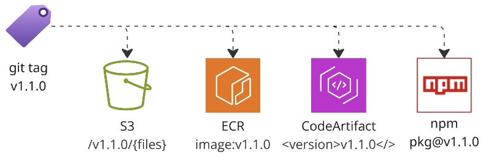

# About
Release software artifacts and git tags together in one action



Main use case - microservices that hold application code and infrastructure code (like Terraform).
Since Terraform is distributed as source code via git tags, the action uses git tags as source of truth for versioning.
It generates new version based on current git tags and SemVer commit tags `#patch`, `#minor`, `#major`,
then publishes artifacts and pushes git tags so your artifacts and git tags are in sync.

This table shows supported artifact types and features:

| Name                   | Multi-tags | Idempotency | version update | dev-release |
|------------------------|------------|-------------|----------------|-------------|
| git                    | ✅          | ✅           | N/A            | ✅           |
| AWS S3                 | ✅          | ✅           | N/A            | ✅           |
| AWS ECR                | ✅          | ✅           | N/A            | ✅           |
| AWS CodeArtifact maven | N/A        | ⚠️          | ✅              | ⚠️          |
| npmjs public repo      | N/A        | ⚠️          | ✅              | ❌           |

1. Generate new version based on the latest tag + git commit message: `#major`, `#minor`, `#patch`
2. Update version in code (`package.json`, `pom.xml`) and commit
   1. maven
   2. npm
   3. custom (can use to update cache key!)
3. Publish artifacts
   1. AWS S3 - upload files in S3 bucket, files need to be in `./s3` directory. Supports dev-release
   2. AWS ECR - publish Docker image in ECR repository
   3. AWS CodeArtifact maven - publish maven package in CodeArtifact repository
   4. npmjs - publish npm package in npmjs.com repository
4. Git push
   1. commit changes from step 2
   2. add tags 'major', 'major.minor', 'major.minor.patch' and 'latest'
   3. atomically push commit and tags to the remote repository

Limitations:
- only `on: push` event is supported — it covers both direct push and PR merge. `on: pull_request` is not yet supported
- when use `on: push` then SemVer tag `#patch`, `#minor`, `#major` is taken only from last commit message, keep it in mind when merging PRs
- only `main` branch is supported for now
These limitations should be gone in future, see roadmap

**Consistency**. This GH action does two modify operations: "Publish artifacts" and then "Git push"
Some of them need to go first, and then you need to be prepared what to do if second fails.
Rationale to have "Git push" the last: 1) it is least likely to fail; 2) provided that all publish steps are idempotent,
you can fix "Git push" issue and re-run the workflow w/o side effects.
Some publish commands are not idempotent (like npm publish), so as workaround - just ignore 'same version already exists' type of errors 
if it is already not first workflow run (use `${{ github.run_attempt }}`)


## Inputs
- `tag-context` - Context for tag generation: 'repo' (default) or 'branch'.
  Use 'branch' to release from non-main long-living branches such as v1-support (given v2 is in main).
  Also use 'actions/checkout' with 'fetch-depth: 0'
- `version` - Explicit version to use instead of auto-generating. When provided, only this single version/tag will be created (no latest, major, minor tags). Cannot be used with dev-release=true


## Outputs
- `version` - version that was used/generated


## Setup
1. Pick AWS account for publishing artifacts, place it in `vars.AWS_ACCOUNT_DIST`
2. Create S3 bucket to publish raw artifacts, ECR repository for Docker images, CodeArtifact for software packages
3. Create IAM role (ex. `ci/publisher`) with respective permissions: `s3:PutObject`, `ecr:PutImage`, `codeartifact:PublishPackageVersion` etc.<br>
   Reference role can be found in `iam.tf` file in this repo
4. Passing `aws-access-key-id` and `aws-secret-access-key` is discouraged (less secure)
   Instead we'll use OpenID provider, see example in `iam.tf` file in this repo


## Main use cases


### git tag only
For example, for repository with terraform code only - no binaries, just add git tag<br>
Version will be automatically generated based on current tags + consider commit message tag `#major`, `#minor`, `#patch`<br>
Ex: if current tag is `1.2.3` and commit has #patch, then the new tag will be `1.2.4`.
Also tags `1`, `1.2` and `latest` will be overwritten to point to the same commit as `1.2.4`
```yaml
jobs:
   Release:
      runs-on: ubuntu-latest
      permissions:
         contents: write
      steps:
         - name: Checkout
           uses: actions/checkout@v4

         - name: Release
           uses: agilecustoms/release@main
```
Note: adding/overwriting tags requires GH job permissions `content: write`


### publish in AWS S3
Convention: there should be `s3` directory in cwd. All content of this directory will be uploaded in S3 bucket<br>
Ex: if current tag is '1.2.3' and commit has #patch, then files will be uploaded to `aws-s3-bucket/aws-s3-bucket-dir/1.2.4`
Also files will be uploaded in dirs `/1`, `/1.2` and `/latest` - previous content of these dirs will be cleaned up
```yaml
steps:
  - name: Release
    uses: agilecustoms/release@main
    with:
      aws-account: ${{ vars.AWS_ACCOUNT_DIST }}
      aws-region: us-east-1
      aws-role: 'ci/publisher' # default
      aws-s3-bucket: 'mycompany-dist'
```
Additionally, you can specify `aws-s3-dir`, then files will be uploaded to `s3-bucket/{aws-s3-dir}/{current-repo-name}/{version}/{files from ./s3 directory}`<br>
Convention: publishing of all AWS types of artifacts require `aws-account`, `aws-region` and `aws-role` parameters

**dev-release** will publish files in `s3-bucket/{aws-s3-dir}/{current-repo-name}/{branch-name}/` directory.
Each S3 file will be tagged with `Release=false`, so you can set up lifecycle rule to delete such files after 30 days!


### publish in AWS ECR
First you build docker image, and then you release it with this action.
Same as git tags, when you release version `1.2.3` with commit message `#patch`,
new docker image will be tagged as `1.2.4`, and tags `1`, `1.2` and `latest` will be overwritten to point to the same image as `1.2.4`
```yaml
steps:
  - name: Docker build
    run: docker build

  - name: Release
    uses: agilecustoms/release@main
    with:
      aws-account: ${{ vars.AWS_ACCOUNT_DIST }}
      aws-region: us-east-1
      aws-role: 'ci/publisher'
      aws-ecr: true
```

**dev-release** works smoothly with ECR: Docker image gets published with tag equal to branch name.
ECR allows to configure lifecycle rules by tag prefix, so if you adopt `dev/` prefix for your dev-release branches,
then you can set up ECR lifecycle rule to delete images with prefix `dev-` after 30 days automatically!


### publish in AWS CodeArtifact Maven repository
This action releases maven artifacts in AWS CodeArtifact repository.
Note: it doesn't compile source code, nor run tests, it just updates version in `pom.xml` and publishes it.
So make sure you maven "heavy lifting" (compile, test, package) prior to this action.
See .. for details how to setup settings.xml, pom.xml and how to use artifacts published by this action.
```yaml
steps:
  - name: Release
    uses: agilecustoms/release@main
    with:
      aws-account: ${{ vars.AWS_ACCOUNT_DIST }}
      aws-region: us-east-1
      aws-role: 'ci/publisher'
      aws-codeartifact-maven: true
```
**dev-release** works is nothing else than just a normal release, but instead of semver `<version>1.2.4</version>`
you'll get `<version>{branch-name}</version>`. Particularly, there is no way to automatically delete such "dev versions".
Such versions will live in CodeArtifact repository forever until you delete them

### publish in public npmjs repo
Publish in *public* npmjs repository. Contribute to support private npmjs repositories if needed.
This will generate new version, update version in `package.json`, commit, push commit + tags and publish in npmjs.com
```yaml
steps:
  - name: Release
    uses: agilecustoms/release@main
    with:
      npmjs-token: ${{ secrets.NPMJS_TOKEN }}
```
**dev-release** assumes you publish a version named after branch name, but npm only supports semantic versioning.
Best alternative is to publish a specific version say latest is `1.2.3` and you publish `1.2.3-test` 


## Additional use cases


### release from non-main branch
Assume main development (v2.x) is conducted in `main` branch, while version 1.x is maintained in `v1-support` branch.
If you want to make release in support branch, you need
1. run actions/checkout with with `fetch-depth: 0`
2. pass parameter `tag-context: branch`
```yaml
on:
   push:
      branches:
         - v1-support
jobs:
   Release:
      runs-on: ubuntu-latest
      permissions:
         contents: write
      steps:
         - name: Checkout
           uses: actions/checkout@v4
           with:
              fetch-depth: 0

         - name: Release
           uses: agilecustoms/release@main
           with:
               tag-context: branch
```
Note: tag `latest` is only added to default (typically `main`) branch,
so if you release new `#patch` version in "support" branch w/ and most recent tag is "1.2.3",
then new tag will be `1.2.4` plus tags `1`, `1.2` will be overwritten to point to the same commit as `1.2.4`, but `latest` tag will not be changed


### dev release
Dev release allows to publish artifacts temporarily for testing purposes:
you push your changes to the feature branch, branch name becomes this dev release version:
- semver is _not_ generated
- no git tags created — your branch name is all you need
- if branch name is `dev/feature` then the version will be `dev-feature`
- parameter `dev-release-prefix` (default value is `dev/`) enforces branch naming for dev releases, it helps to automatically dispose dev release artifacts. Set to empty string to disable such enforcement
- for each artifact type, dev-release might have different semantics, see `dev-release` section for each artifact type

Example of 'dev-release' usage with AWS S3:
```yaml
steps:
  - name: Release
    uses: agilecustoms/release@main
    with:
      aws-account: ${{ vars.AWS_ACCOUNT_DIST }}
      aws-region: us-east-1
      aws-role: 'ci/publisher' # default
      aws-s3-bucket: 'mycompany-dist'
      dev-release: true
      dev-release-prefix: 'dev/' # default
```


### explicit version
Use the `version` input parameter to specify an exact version instead of auto-generating one.
When provided, only this single version/tag will be created (no `latest`, `major`, or `minor` tags).
Typically, you use normal release flow (for trunk based development)
or `tag-context: branch` to release a new version from non-default branch (such as old version support).
You would use `dev-release: true` to test some feature before merging it. Use explicit **version** as last resort:
1. to fix existing version in-place
2. instead of dev-release when it is not supported

Example of `version` usage with AWS ECR:
```yaml
steps:
  - name: Release
    uses: agilecustoms/release@main
    with:
      aws-account: ${{ vars.AWS_ACCOUNT_DIST }}
      aws-region: us-east-1
      aws-role: 'ci/publisher'
      aws-ecr: true
      version: '1.1.8'
# Creates only tag: 1.1.8
```
**Use with great caution** as it may break your release cycle, imagine release chain (all in one branch):
```
1.1.6
1.1.7
1.2.0
1.2.1
1.1.8 <-- you just released with manual version
```
Then you make a normal `#minor` release (no explicit version) and you'll get another `1.2.0`
So be very careful with doing explicit version in the right branch!


### custom-version-update
TBD


## Credits
- https://github.com/anothrNick/github-tag-action
